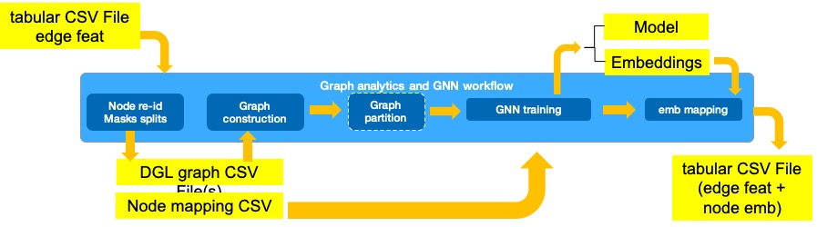

# Graph Neural Networks and Analytics

This workflow shows how to run Graph Neural Network (GNN) training on CPUs in single and distributed mode. The workflow reads tabular data, ingests it into graph format, and then uses a GNN to learn embeddings used as rich features in a downstream task.

This workflow is used by the [Fraud Detection Reference Kit](https://github.com/intel/credit-card-fraud-detection)

Check out more workflow examples and reference implementations in the [Dev
Catalog](https://developer.intel.com/aireferenceimplementations).

## Overview
Graph Neural Networks are effective models for generating node/edge embeddings that can be used as rich features to improve accuracy of downstream tasks.
This workflow provides a step-by-step example for how GNNs can be used in fraud detection to extract node embeddings for all entities (credit cards and merchant) based on the graph structure defined by the transactions between them.

General steps:
- Conversion of tabular data into a set of files (nodes.csv, edges.csv and meta.yml). These CSV files form a CSVDataset for ingestion into [Deep Graph Library (DGL)](https://www.dgl.ai/) graph.
- Training of GNN GraphSAGE model for self-supervised transductive link prediction task. If this is performed on a cluster of machines this training is preceded by graph partitioning.
- Mapping of generated node embeddings into original tabular dataset.


## Hardware Requirements
There are workflow-specific hardware and software setup requirements depending on how the workflow is run. Bare metal development system and Docker image running
locally have the same system requirements.

| Recommended Hardware         | Precision  |
| ---------------------------- | ---------- |
| Intel® 1st, 2nd, 3rd, and 4th Gen Xeon® Scalable Performance processors| FP32 |

For distributed training a high-speed fabric across nodes (e.g., OPA, Mellanox) is recommended.

Workflow has been tested on OS Rocky Linux v8.7 and Ubuntu 20.04

## How it Works

Use cases such as fraud detection, are characterized by class imbalance in their datasets that makes training predictor models directly with those labels difficult. This GNN workflow shows an example of how a self-supervised task can be formulated (instead of using the hard imbalanced labels) to learn entity features that capture the graph structure for use by a downstream predictor model such as XGBoost. In this workflow, the self-supervised task consists of link prediction where the edges in the graph are used as positive examples and non-existent edges as negative examples.

GNN workflow ingests tabular data where each row corresponds to a transaction between two types of entities: cards and merchants, and generates a graph where entities are the nodes (that are featureless), and transactions constitute the edges with the associated transaction feature attributes.

The GNN model consists of a learnable embedding layer followed by an encoder, implemented as a 2-layer GraphSAGE model, and a decoder, implemented as a 3-layer multilayer perceptron (MLP) with a single output for link prediction. During training, positive and negative neighbor sampling is used to generate the training examples. We use a Receiver Operating Characteristic Area Under Curve score (ROC AUC) as the metric to evaluate the quality of the embeddings in predicting if two entities should be connected. The ultimate measure of how useful these embeddings are in predicting fraud needs to be measured by the downstream predictor model, since this workflow is not using the fraud labels directly.

After several epochs of training, we run GNN inference on the entire graph without neighbor sampling and use the last layer activations generated by the model as node embeddings for nodes of the graph. These embeddings can be mapped to the entities in the tabular data input and used as node features for a downstream prediction task.




## Get Started

### 1. Download the Workflow Repository
Create a working directory for the workflow and clone the [Main
Repository](https://github.com/intel/graph-neural-networks-and-analytics>) repository into your working
directory.

```
mkdir ~/work && cd ~/work
git clone https://github.com/intel/graph-neural-networks-and-analytics
cd graph-neural-networks-and-analytics
git checkout main
export WORKSPACE=$PWD
```

### 2. Download the Dataset

The input to this workflow is tabular data in CSV format where each row corresponds to a credit card transaction.
Each transaction includes the IDs of the entities involved (Card and Merchant) and the edge features (amount of the transaction, date, etc.).

There are two options for processing the input data:


#### 2a. Run as part of Fraud Detection Reference Kit

If you are running this workflow as part of the [Fraud Detection Reference Kit](https://github.com/intel/credit-card-fraud-detection) the input to this workflow will be the output of the data preprocesssing (featurized edge data) stage.

OR

#### 2b. Run standalone
If you want to run this workflow in standalone mode, download the synthetic credit card transaction dataset [IBM/tabformer](https://github.com/IBM/TabFormer/blob/main/data/credit_card/transactions.tgz) and use the utility script below to featurize the data using pandas.

```bash
#run this script to create conda environment
./script/build_dgl1_env.sh
conda activate dgl1.0
#path to downloaded data. Include filename
DATA_IN=< YOUR PATH TO >/card_transaction.v1.csv
#path for processed_data.csv. Include filename
PROCESSED_DATA=< PATH TO SAVE >/processed_data.csv

#read raw data, perform edge featurization and generate CSVDataset files for ingesting graph
./script/run_data_prep.sh $DATA_IN $PROCESSED_DATA
```

---
In these sections you will find instructions on how to run this workflow in different ways:
- [Run single node Using Docker](#run-using-docker)
- [Run Bare Metal on a single node](#run-bare-metal-on-a-single-node)
- [Run Bare Metal on a cluster of machines](#run-bare-metal-on-a-cluster-of-machines)

## Run Using Docker
Follow these instructions to set up and run our provided Docker image.

### 1. Set Up Docker Engine
You'll need to install Docker Engine on your development system.
Note that while **Docker Engine** is free to use, **Docker Desktop** may require
you to purchase a license.  See the [Docker Engine Server installation
instructions](https://docs.docker.com/engine/install/#server) for details.

### 2. Set Up Docker Image
There are two options:

#### 2a. Pull the provided docker image
```bash
docker pull intel/ai-workflows:eap-fraud-detection-gnn
```
OR
#### 2b. Build the image yourself

```bash
cd $WORKSPACE
./script/build-image.sh
```

If your environment requires a proxy to access the internet, export your
development system's proxy settings to the docker environment:
```
export DOCKER_RUN_ENVS="-e ftp_proxy=${ftp_proxy} \
  -e FTP_PROXY=${FTP_PROXY} -e http_proxy=${http_proxy} \
  -e HTTP_PROXY=${HTTP_PROXY} -e https_proxy=${https_proxy} \
  -e HTTPS_PROXY=${HTTPS_PROXY} -e no_proxy=${no_proxy} \
  -e NO_PROXY=${NO_PROXY} -e socks_proxy=${socks_proxy} \
  -e SOCKS_PROXY=${SOCKS_PROXY}"
```

### 3. Run Docker Image
Run the workflow using the ``docker run`` command, as shown:
```
export CODE_DIR=<path to cloned repo >
export DATASET_DIR=<path to /data/edge_data>
export OUTPUT_DIR=<path to /data/node_edge_data>
export TMP_DIR=<host path to /gnn_tmp>
docker run --shm-size=200g --network host \
  -v ${CODE_DIR}:/host \
  -v ${DATASET_DIR}:/DATA_IN \
  -v ${OUTPUT_DIR}:/DATA_OUT \
  -v ${TMP_DIR}:/GNN_TMP \
  -it intel/ai-workflows:eap-fraud-detection-gnn /bin/bash
```
If you generated your own image in step 2b replace the docker image name in the last line `intel/fraud-detection:eap-gnn` with `gnn-wf:latest`.

### 4. Launch GNN workflow
Once inside the container, run the workflow with:
```bash
cd /host
python ./src/gnn_workflow.py \
--data_in /DATA_IN/processed_data.csv \
--data_out /DATA_OUT/tabformer_with_gnn_emb.csv \
--gnn_tmp /GNN_TMP
```
When training completes, find the CSV dataset with the original edge features and newly added nodes embeddings in your host system output directory:
```
$OUTPUT_DIR/tabformer_with_gnn_emb.csv
```
The successful training completion will show on the console the train, test, and validation roc_auc scores followed by additional details:

```
...
time to train GNN:  <this will vary based system>
Loading embeddings from file and adding to preprocessed CSV file
CSV output shape:  (24198836, 154)
Time to append node embeddings to edge features CSV <this will vary based on system>
```
## Run Bare Metal on a single node
Follow these instructions to set up and run this workflow on your own development
system.

For running usind Docker or on a cluster of machines follow these:
- [Run single node using Docker](#run-using-docker)
- [Run Bare Metal on a cluster of machines](#run-bare-metal-on-a-cluster-of-machines)

### 1. Set Up System Software
Our examples use the `conda` package and environment on your local computer.
If you don't already have `conda` installed, see the [Conda Linux installation
instructions](https://docs.conda.io/projects/conda/en/stable/user-guide/install/linux.html).

### 2. Set Up Workflow
Run these commands to set up the workflow's conda environment and install required software packages and libraries:
```bash
cd <working directory>
git clone https://github.com/intel/graph-neural-networks-and-analytics
cd graph-neural-networks-and-analytics
git checkout main
./script/build_dgl1_env.sh
conda activate dgl1.0
```

### 3. Run Workflow
Use these commands to run the workflow:
```bash
cd $WORKSPACE
python ./src/gnn_workflow.py \
--data_in <path to input file tabformer_processed.csv> \
--data_out <path to output file tabformer_with_gnn_emb.csv> \
--gnn_tmp <path to a tmp dir>
```
The successful training completion will show on the console the train, test, and validation roc_auc scores followed by additional details:

```
...
time to train GNN:  <this will vary based system>
Loading embeddings from file and adding to preprocessed CSV file
CSV output shape:  (24198836, 154)
Time to append node embeddings to edge features CSV <this will vary based on system>
```
## Run Bare Metal on a cluster of machines
In this section we will show how to run this GNN workflow in a distributed cluster of machines.

Follow these instructions for running using Docker or on a single node:
- [Run single node using Docker](#run-using-docker)
- [Run Bare Metal on a single node](#run-bare-metal-on-a-single-node)

### 1. Set Up System Software
Our examples use the `conda` package and environment on your local computer.
If you don't already have `conda` installed, see the [Conda Linux installation
instructions](https://docs.conda.io/projects/conda/en/stable/user-guide/install/linux.html).

**Prerequisite:** Before you can run in a distributed cluster, you need to configure passwordless ssh access across machines and have a distributed file system so the conda environment, data and files can be accessed across multiple machines. See these linked documents on how to set up [passwordless ssh](https://linuxize.com/post/how-to-setup-passwordless-ssh-login/) and set up [Distributed File System](https://github.com/dmlc/dgl/tree/1.0.0/examples/pytorch/graphsage/dist).

### 2. Set Up Workflow
Run these commands to set up the workflow's conda environment and install required software:
```
cd <working directory in distributed file system>
git clone https://github.com/intel/graph-neural-networks-and-analytics
cd graph-neural-networks-and-analytics
WORKSPACE=$PWD
git checkout main
./script/build_dgl1_env.sh
conda activate dgl1.0
```
This conda environment should be located in distributed file system so it can be used by all machines in cluster. The workflow takes care of activating the conda environment in the remote machines.

### 3. Run Workflow

#### 3.1: Create an ip_config.txt file
Create your own IP configuration file `ip_config.txt` inside the working directory. Replace the example IPs in the example below, with the IP addresses of the machines in your cluster.

```bash
123.12.3.1
123.12.3.2
```
#### 3.2: Build Graph
In this stage we are reading the preprocessed data (CSV with ~24M transactions and 21 feature columns) and writing a set of CSV Files (CSVDataset) for graph data ingestion to DGL.

```bash
#path for processed_data.csv (from Fraud Detection Reference Kit case or processed by run_data_prep.sh above)
PROCESSED_DATA=< PATH TO SAVE >/tabformer_processed.csv
#select a path in distributed file system to save CSVDataset CSV files
GNN_TMP=< PATH TO SAVE CSVDATASET>

#read raw data, perform edge featurization and generate CSVDataset files for ingesting graph
./script/run_build_graph.sh $PROCESSED_DATA $GNN_TMP
```
The successful execution of this stage will create the below contents under $GNN_TMP directory:
```
./sym_tabformer_hetero_CSVDataset/
├── edges_0.csv
├── edges_1.csv
├── meta.yaml
├── nodes_0.csv
└── nodes_1.csv
```
#### 3.3: Partition the graph
Distributed training requires that the graph is partitioned and different machines operate on different subgraphs. Set the number of partitions to match the number of machines in your cluster. In our example, this partition is happening on a single node.

```bash
# defined in previous step or set based on classic ML workflow output
GNN_TMP=<PATH TO PARENT DIRECTORY TO CSVDATASET>
# select number of partitions, should match number of machines in your cluster
NUMPART=2
# directory to store partitions in distributed file system
PART_DIR=<PATH TO SAVE GRAPH PARTITIONS>

#ingest CSVDataset and partition graph
./script/run_graph_partition.sh $GNN_TMP $NUMPART $PART_DIR
```
The successful execution of this stage will create the below contents under $PART_DIR/partitions directory:

```
tabformer_2parts/
├── emap.pkl
├── nmap.pkl
├── part0
│   ├── edge_feat.dgl
│   ├── graph.dgl
│   └── node_feat.dgl
├── part1
│   ├── edge_feat.dgl
│   ├── graph.dgl
│   └── node_feat.dgl
└── tabformer_full_homo.json
```
                                        
#### 3.4: Run distributed training
Launch distributed training and if MAP_SAVE=true, perform output mapping and generate a CSV file combining the preprocessed edge features from Step 2 and the node embeddings generated by this GNN workflow. This file will have 154 features per transaction and can be used for the fraud prediction downstream task. For an example of fraud detection with XGBoost using these gnn_features, refer to [Fraud Detection Reference Kit](https://github.com/intel/credit-card-fraud-detection).

The mappings happening in this stage are:
1) the mapping from the local to global graph IDs (node/edge ID's) and
2) the mapping between global graph ID's and the card and merchant ID's in the tabular dataset.

```bash
MAP_SAVE=true 
OUT_DIR=< PATH TO SAVE tabformer_with_gnn_emb.csv >
#GNN TMP defined earlier is used to also store gnn model and embeddings

#launch distributed training and if MAP_SAVE=True do map embeddings to CSV input file
./script/run_dist_train.sh $PROCESSED_DATA $GNN_TMP $PART_DIR $NUMPART $OUT_DIR $MAP_SAVE $CONDA_PREFIX
```
The successful execution of this stage will save the trained GNN model `tabformer_graphsage_2L_64_emb.pt` and the node embeddings `node_emb.pt` under the `$GNN_TMP` directory.

## Expected Output

Once the training is complete, we generated node embeddings for all entities (card and merchants) in our dataset that can be used as features for a downstream task such as fraud detection.
The generated embeddings are added to the transaction data by appending the corresponding card and merchant embeddings for each transaction, resulting in a CSV file with 154 feature columns. The output file (~35GB) can be found on your host system's output directory:

```bash
#resulting file with edge features and node embeddings
$OUT_DIR/tabformer_with_gnn_emb.csv
#the distributed training log can be found at:
${WORKSPACE}/logs
```

As you follow along the training progress in the terminal logs, link prediction roc_auc_score on test set should achieve a score around 0.7.

## Summary and Next Step
We have seen how tabular data such as credit card transactions can be modeled as a graph and how GNNs can be used to generate node embeddings used to boost accuracy of downstream tasks.
In addition we have shown how to perform this GNN training on a container or on bare metal as a single node or multiple nodes.

## Learn More
For more information about Graph Neural Networks and Analytics workflow or to read about other relevant workflow examples, see these guides and software resources:

- [Fraud Detection Reference Kit](https://github.com/intel/credit-card-fraud-detection)
- [Classic ML Workflow](https://github.com/intel/recommender-system-with-distributed-classical-ml)


## Troubleshooting
1. Distributed training uses Pytorch with GLOO backend. If step 3.4 gives a Connection Refused RuntimeError from third_party/gloo you may try adding `--extra_envs GLOO_SOCKET_IFNAME=eth0` in run_dist_train.sh after launch.py. Replace `eth0` above with the right network interface in your system.
2. If distributed training gets interrupted and cannot restart training successfully afterwards you may need to manually kill python processes in the remote machines.
3. If you see a TargetEncoder python import error when running run_data_prep.sh you can install it into your dgl1.0 conda environment using `conda install -c conda-forge category_encoders`.
4. If you get a Permission denied error when running a bash script such as `./script/run_build_graph.sh`, it can be fixed by `chmod +x ./script/run_build_graph.sh`


---

\*Other names and brands may be claimed as the property of others.
[Trademarks](https://www.intel.com/content/www/us/en/legal/trademarks.html).
